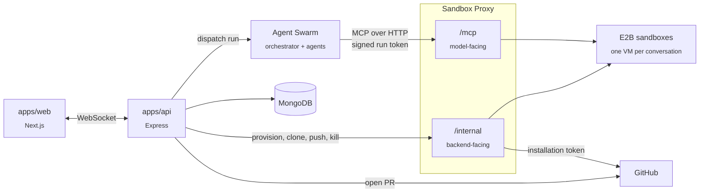

# CodeAgent

An AI coding agent that works on your repository inside an isolated sandbox.
Connect a GitHub repo, describe what you want, and the agent reads, edits, and
runs your code in a dedicated VM — then commits, and opens a pull request once
you approve the diff.

> **Status: early.** Authentication and the GitHub connection work end to end.
> The sandbox layer and the agent itself are designed but not yet built — see
> [What works today](#what-works-today) and [Roadmap](#roadmap).

## Design

The system is four services around one hard constraint: **a GitHub credential
never enters the sandbox, and the model can never reach a credentialed
operation.**



The sandbox proxy is the single choke point in front of every VM. It has two
faces: `/mcp`, which the agent reaches with a signed, expiring token scoped to
exactly one sandbox, and `/internal`, which only the backend can reach and
which is the only place a GitHub installation token is ever used. Provisioning,
cloning, and pushing are deliberately *not* agent tools.

Full design in [`docs/sandbox-proxy.md`](docs/sandbox-proxy.md).

## Repository layout

```
apps/
  web/        Next.js 16 — landing page, /code workspace, Google sign-in
  api/        Express — sessions, GitHub App connection
packages/
  db/         Mongoose schemas (User, Conversation, GitHubCredential, ChatResponse)
  ui/         Shared React components
  tailwind-config/, eslint-config/, typescript-config/
docs/         Design docs (read these first)
```

## Documentation

| Doc | Covers |
|---|---|
| [`sandbox-proxy.md`](docs/sandbox-proxy.md) | The proxy's two faces, run-token auth, and the full call sequence of a run |
| [`agent-swarm.md`](docs/agent-swarm.md) | Run loop, execution + query agents, tool surface, safety caps |
| [`github-app-auth-flow.md`](docs/github-app-auth-flow.md) | The five credential phases, install through PR |
| [`system-communication-protocols.md`](docs/system-communication-protocols.md) | Every edge between services and the protocol it uses |
| [`data-model.md`](docs/data-model.md) | Persisted collections and their relationships |
| [`sandbox-viewer.md`](docs/sandbox-viewer.md) | Live VS Code and browser views into a running sandbox |

`sandbox-proxy.md` is the most recent and supersedes how the older docs
describe PX — see its reconciliation table.

## Getting started

### Prerequisites

- [Bun](https://bun.sh) 1.3.14 (Node.js ≥ 18 also required)
- A GitHub App (below)
- A Google OAuth client (below)

### 1. Create a GitHub App

At **Settings → Developer settings → GitHub Apps → New GitHub App**:

- **Callback URL:** `http://localhost:3001/github/callback`
- **Request user authorization (OAuth) during installation:** ✅ enabled —
  the connect flow expects `code` and `installation_id` to arrive together
- **Repository permissions:** Contents (read & write), Pull requests
  (read & write), Metadata (read)

Generate a private key and download the `.pem`.

### 2. Create a Google OAuth client

Google Cloud Console → APIs & Services → Credentials → OAuth 2.0 Client ID.

- **Authorised redirect URI:** `http://localhost:3001/api/auth/callback/google`

### 3. Configure environment

```bash
cp apps/web/.env.example apps/web/.env
cp apps/api/.env.example apps/api/.env
```

Fill both in. `SESSION_SECRET` must be **byte-identical across the two files** —
the web app signs the session cookie and the API verifies it:

```bash
openssl rand -hex 32
```

### 4. Install and run

```bash
bun install
bun run dev
```

- Web: <http://localhost:3001>
- API: <http://localhost:3002>

### Other commands

```bash
bun run build         # build all packages
bun run lint          # eslint, zero warnings tolerated
bun run check-types   # tsc --noEmit across the monorepo
bun run format        # prettier
```

## What works today

- Google sign-in via NextAuth, minting a platform session cookie
- `/code` guarded by that session ([`apps/web/proxy.ts`](apps/web/proxy.ts))
- GitHub App install + connect, as a separate concern from sign-in — a user
  signs in with Google, then connects one or more GitHub installations
- Listing repositories for a connected installation
- The `/code` workspace shell (sidebar, tabs, prompt bar) — UI only

### Not yet built

- **Persistence.** `packages/db` defines schemas but nothing connects to
  MongoDB yet; GitHub installations currently live in an in-memory `Map` in
  [`apps/api/src/lib/store.ts`](apps/api/src/lib/store.ts) and are lost on
  restart.
- The sandbox proxy, E2B integration, and the agent swarm
- The chat WebSocket and run streaming
- The VS Code / browser sandbox viewer

## API

All routes require the platform session cookie.

| Method | Route | Purpose |
|---|---|---|
| `GET` | `/api/session/me` | Current user and their GitHub connections |
| `POST` | `/api/github/callback` | Complete a GitHub App installation |
| `GET` | `/api/github/repos?installationId=` | Repositories for one installation |

## Roadmap

0. Connect MongoDB; move the installation store onto real models; add a `Run`
   collection
1. Sandbox proxy `/internal`: provision, clone, kill
2. Tool executor: `read_file`, `list_dir`, `run_command`
3. Orchestrator loop end to end — prompt through to streamed tool calls in the UI
4. Full tool surface and safety caps
5. Approval → push → pull request
6. Sandbox viewer, semantic code search, the query agent
