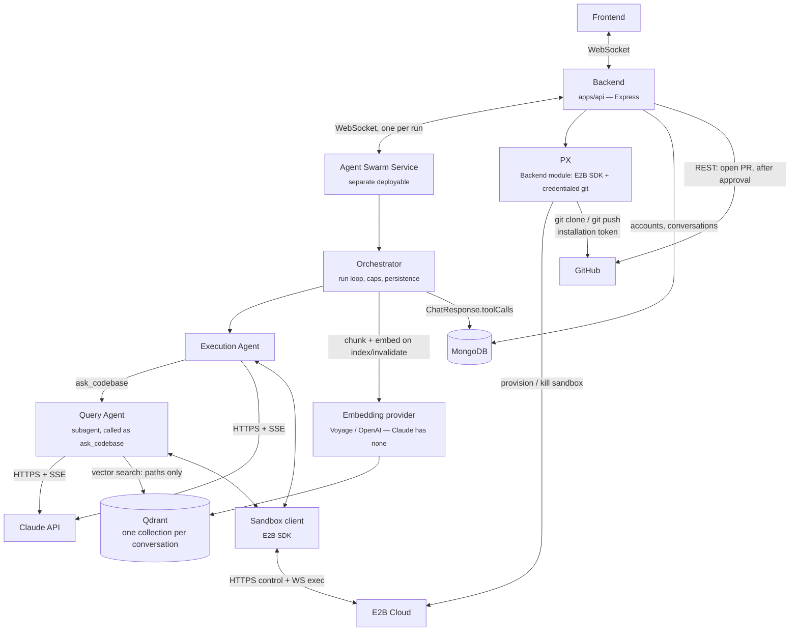
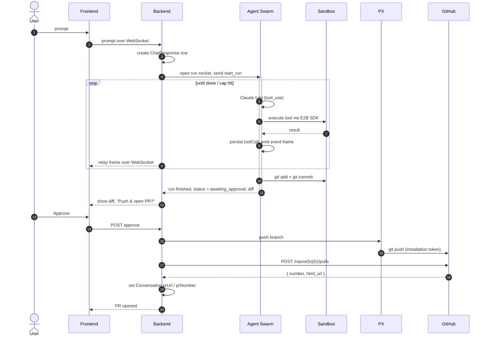

# Agent Swarm Architecture v1

How a user prompt becomes a reviewed, pushed branch — the run loop, the two
agents, their tool surface, and the boundary between what the agent may do and
what only the Backend may do.

## Scope

Self-contained: this doc owns the Agent Swarm design and does not require
changes to the other docs. It assumes the sandbox already exists with the repo
checked out — provisioning and credentials are
[github-app-auth-flow.md](github-app-auth-flow.md) Phases 1–3, transports are
[system-communication-protocols.md](system-communication-protocols.md), and
persisted shape is [data-model.md](data-model.md). The viewer surfaces
([sandbox-viewer.md](sandbox-viewer.md)) are independent and run concurrently
with a run.

## Topology



## The credential boundary

This is the constraint that shapes the whole tool surface.
[github-app-auth-flow.md](github-app-auth-flow.md) states the raw installation
token never enters the sandbox: PX clones (Phase 3), PX pushes (Phase 4), and
Backend opens the PR over REST. Anything requiring a GitHub credential is
therefore **not an agent tool** — it is a Backend action that approval
triggers.

| Operation | Who performs it | Why |
|---|---|---|
| `git clone` | PX, before the run | Needs the installation token; Phase 3 |
| `git commit`, `git diff`, `git status`, branch create | **Agent** | Local to the working tree, no credential |
| `git push` | PX, after user approval | Needs the token; Phase 4 |
| Open PR | Backend, REST, after push | Needs the token; Phase 4 |
| `git pull` / remote fetch | Nobody | The sandbox is a fresh clone per run — nothing to pull |

A run therefore **ends at commit**. It never pushes and never opens a PR.

## Run lifecycle



## Components

- **Orchestrator** — not an LLM. Owns the run: builds each request, dispatches
  tool calls to the sandbox, persists every call, emits event frames, enforces
  the caps below, decides when the run is done.
- **Execution Agent** — `claude-opus-5`, adaptive thinking (on by default;
  never send `budget_tokens`, it 400s), `output_config: { effort: "xhigh" }`,
  streamed. Holds the mutating tool surface.
- **Query Agent** — a *subagent*, invoked only as the `ask_codebase` tool.
  Read-only. Its own message history, so it never pollutes the execution
  agent's context and never invalidates the execution loop's prompt cache the
  way switching models mid-conversation would.

## Tool surface

### Execution agent

| Tool | Notes |
|---|---|
| `read_file(path, offset?, limit?)` | Offset/limit so large files don't blow context |
| `list_dir(path)` | |
| `grep(pattern, glob?)` | ripgrep in the sandbox |
| `write_file(path, content)` | Create or overwrite |
| `edit_file(path, old_string, new_string)` | **Partial** edit. Without it the model re-emits whole files — where token cost and file corruption both come from |
| `delete_file(path)` / `move_file(from, to)` | |
| `run_command(cmd, cwd?, timeout?)` | E2B exec; stdout/stderr/exit code |
| `git_status()` / `git_diff(path?)` | Local only |
| `git_create_branch(name)` / `git_add(paths)` / `git_commit(message)` | Local only |
| `ask_codebase(question)` | Delegates to the query agent |

File writes are dedicated tools rather than `run_command` strings so the
orchestrator can enforce a staleness check (reject a write to a file the agent
hasn't read this run) and invalidate the vector index — neither is possible
through an opaque shell command.

### Query agent (read-only)

`vector_search(query, k)`, `grep`, `list_dir`, `read_file`. No writes, no
`run_command`, no git.

## Keeping the index honest

The vector index is a **locator, not a source of truth**. `vector_search`
returns paths and line ranges with scores; the query agent then reads the live
file out of the sandbox before answering. A file edited seconds ago can rank
poorly, but it can never be *quoted* stale.

On top of that, every mutating file tool enqueues a re-index of the affected
path — chunk, embed, upsert — so ranking catches up too.

Indexing runs once at session start, after PX has cloned into the sandbox: the
orchestrator walks the tree over the E2B SDK, chunks, embeds, and upserts into
a Qdrant collection named for the conversation. Every query carries a
mandatory `conversationId` filter, applied in the client wrapper rather than at
each call site; the collection is dropped when the sandbox is killed.

## The run socket

**One socket per run**, opened by Backend at dispatch, closed when the run
reaches a terminal state. A per-run socket keeps the connection's lifetime
equal to the run's and keeps affinity automatic.

| Direction | Frames |
|---|---|
| Backend → Swarm | `start_run`, `cancel`, `user_message` (follow-up mid-run) |
| Swarm → Backend | `tool_call_started`, `tool_call_finished`, `assistant_delta`, `run_finished`, `run_failed` |

Every swarm→Backend frame carries `{ runId, seq, ... }` where `seq` is a
per-run monotonic counter — it is what makes late joins and reconnects correct.

**The run outlives the socket.** A dropped connection must not kill an
in-flight run: the swarm keeps going and Backend reconnects with the run id.
Events missed during the gap replay from `ChatResponse.toolCalls` rather than
from an in-memory buffer, which is why every tool call is persisted as it
happens. Keepalive is the swarm's job (ping every 30s).

## Persisting tool calls

`ChatResponse.toolCalls` carries `status: inProgress | Successful | Failed`,
which only means something if calls are written twice: the orchestrator pushes
a subdocument with `inProgress` when it dispatches, and updates it in place
with output and terminal status when the call returns. The same event goes out
as a frame, which Backend relays onto the frontend socket unchanged.

Mongo is the durable record, the socket is the live view.

## Multi-tenancy

There is no per-user agent process. The Claude API is stateless — every turn
resends the full history — so an "agent" is a system prompt, a tool list, a
message array, and a loop. **One swarm service serves every user.** Isolation
lives in the state a run touches:

| Thing | Scope | Enforced by |
|---|---|---|
| Sandbox (E2B VM) | one per conversation | separate VM — the real security boundary |
| Qdrant collection | one per conversation | mandatory `conversationId` filter |
| Message history | one per conversation | `ChatResponse.conversationId` |
| In-flight run | one per conversation | the run lock below |
| Swarm process | shared | — |

A run is handed a `sandboxId` and a collection name at dispatch and can reach
nothing else.

## Fan-out and the scaling seam

The owner can have several tabs open on one conversation, all live. Backend
keeps a **set** of frontend sockets per conversation, not one.

Today that fan-out is in-process and needs no broker. Write it against a
two-function interface so it survives scaling out:

```
bus.publish(conversationId, frame)
bus.subscribe(conversationId, handler) -> unsubscribe
```

- **Now (single instance):** `LocalBus`, an in-process emitter. The run
  socket's reader calls `bus.publish` for each frame.
- **Later (multi-instance):** `RedisBus` — the swarm publishes to
  `run:{conversationId}` and every Backend instance with a subscriber receives
  it.

**The subscriber side never changes** — fan-out, access checks, and frame shape
are identical under both. Only who calls `publish` moves.

### Late join and reconnect

A tab opening mid-run must get history and the live tail with no gap and no
duplicates. Order matters:

1. Subscribe to the conversation first, buffering what arrives.
2. Read `ChatResponse` for the run from Mongo.
3. Drop buffered frames whose `seq` the replay already covered, flush the rest.

Subscribing before reading is what closes the race — the other order misses
anything published between the read and the subscribe.

### What must not live in Backend memory

These break the day a second instance starts, so they belong in the database
from the beginning:

- **Run state** — `awaiting_approval`, branch name, attempt counter. See Open
  questions.
- **The run lock.** "One in-flight run per conversation" cannot be an in-memory
  guard. Make it a unique index on `{ conversationId, status: "active" }` so a
  second dispatch fails at the database rather than racing.

Sticky sessions are deliberately not required: correctness comes from the bus
plus the Mongo replay, not from routing a tab back where it started.

## Termination and safety caps

Enforced by the orchestrator, not by the model:

- **Tool-call cap** per run (start at 50) and a wall-clock timeout.
- **Task budget** — `output_config.task_budget: { type: "tokens", total: N }`
  with beta `task-budgets-2026-03-13`, minimum 20,000. The model sees a
  countdown and lands the task instead of being cut off mid-edit.
- **Fix-attempt counter per PR, capped at 3.** Phase 5 of the auth flow
  auto-repeats Phases 2–4 on check failure; without a counter a persistently
  failing test loops: push → checks fail → webhook → push. Resets when a human
  comments.
- **Context growth** — enable context editing (`clear_tool_uses_20250919`) so
  old tool results drop out of long runs.

## Approval and the Phase 5 exception

The user approves before the *first* push, which is what creates the PR. Once
that PR exists the branch is already sanctioned, so Phase 5 auto-fix pushes to
that same branch run without a second prompt — bounded by the attempt counter.
Approval is per branch, not per commit.

## Open questions

- **Run state has no home in the schema.** `awaiting_approval` needs somewhere
  durable. Either `Conversation.runStatus` + `branchName` + `attemptCount`, or
  a `Run` collection (`conversationId`, `status`, `branchName`, `attemptCount`,
  `startedAt`). A `Run` collection is the better fit once Phase 5 creates runs
  no user prompt initiated — those have no `ChatResponse` to hang off. **This
  is the blocker for implementation.**
- **Sandbox lifetime vs. approval.** If the user takes an hour to approve, is
  the sandbox still alive? The push reads from the working tree, so either it
  is kept warm or PX holds the commit as a bundle.
- **Embedding provider.** `voyage-code-3` is code-specific and the natural
  pick; `text-embedding-3-large` is the alternative. Either adds a second
  vendor and API key.
- **Query-agent model.** Both agents are specified as `claude-opus-5`. The
  query agent is the obvious place to drop to `claude-haiku-4-5` ($1/$5 per
  MTok vs $5/$25). Worth measuring first — a weak retrieval answer costs the
  execution agent more turns than it saves.
- **Backend → Swarm dispatch** answers the open question left in
  [system-communication-protocols.md](system-communication-protocols.md); that
  doc is unchanged and still records it as open.
