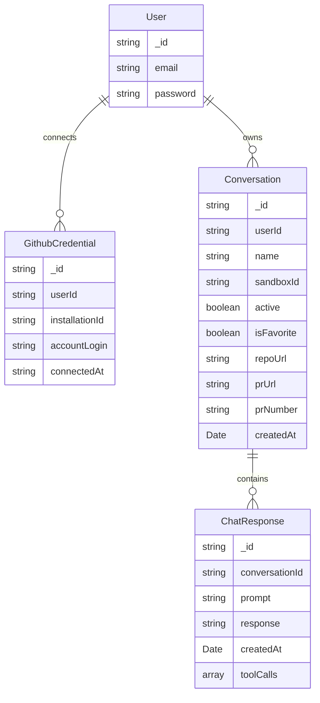

# Data Model

The four collections behind auth, GitHub connections, and chat: `User`,
`GithubCredential`, `Conversation`, `ChatResponse`.

## Scope

This doc covers persisted shape only — how accounts, GitHub installations,
conversations, and chat turns relate to each other. It does not cover token
minting or the OAuth exchange itself (see
[github-app-auth-flow.md](github-app-auth-flow.md)), or how the sandbox is
provisioned per conversation (see
[system-communication-protocols.md](system-communication-protocols.md)).

## Diagram

Ownership is expressed with a foreign key on the child (`userId`,
`conversationId`), not with an id-array on the parent. Querying "all
conversations for this user" is `Conversation.find({ userId })`, not a walk
over an array field — see Open questions below for why the array form was
dropped.

## Collections

### User

| Field | Type | Notes |
|---|---|---|
| `_id` | string | |
| `email` | string | |
| `password` | string | Bcrypt hash, never plaintext. Only set when the account was created via email/password signup — a user who only ever signs in through the GitHub App install flow ([github-app-auth-flow.md](github-app-auth-flow.md) Phase 1) may not have one. Independent of `GithubCredential`: this field identifies the app account, not a GitHub identity. |

### GithubCredential

One row per GitHub App installation a user has connected. A user can connect
more than one (personal account + one or more orgs), so this is its own
collection rather than a field on `User`.

| Field | Type | Notes |
|---|---|---|
| `_id` | string | |
| `userId` | string | FK → `User._id` |
| `installationId` | string | GitHub's installation id, from Phase 1 of the auth flow |
| `accountLogin` | string | The GitHub user/org the app was installed on, for display |
| `connectedAt` | string | ISO timestamp |

Deliberately holds no token. Per
[github-app-auth-flow.md](github-app-auth-flow.md), installation tokens are
minted fresh per task (≤1hr TTL) and must not be persisted.

### Conversation

| Field | Type | Notes |
|---|---|---|
| `_id` | string | |
| `userId` | string | FK → `User._id` |
| `name` | string | |
| `sandboxId` | string | Current/most recent E2B sandbox for this conversation. Sandboxes are ephemeral — expect this to be overwritten if the sandbox is killed and a new one is provisioned on resume. |
| `active` | boolean | Whether the sandbox above is currently live |
| `isFavorite` | boolean | |
| `repoUrl` | string | Repo this conversation is operating on |
| `prUrl` | string \| null | Set once Phase 4 of the auth flow opens a PR; null until then |
| `prNumber` | string \| null | Same lifecycle as `prUrl` |
| `createdAt` | Date | |

`prUrl`/`prNumber` are what closes the loop with
[github-app-auth-flow.md](github-app-auth-flow.md) Phase 4 (PR opened) and
Phase 5 (webhook auto-fix loop) — the webhook handler needs a way to find the
conversation for a given PR without scanning every user.

### ChatResponse

One row per prompt/response turn.

| Field | Type | Notes |
|---|---|---|
| `_id` | string | |
| `conversationId` | string | FK → `Conversation._id` |
| `prompt` | string | |
| `response` | string | |
| `createdAt` | Date | |
| `toolCalls` | `{ name: string, input: object, output: string, status: string }[]` | Structured, not flat strings — needed to render what a tool actually did (matches the Agent Swarm ↔ Sandbox exec calls in [system-communication-protocols.md](system-communication-protocols.md)) |

## Naming conventions

- Primary key is always `_id: string`, including on `ChatResponse` (fixes an
  earlier draft that used `id`).
- Timestamps are `createdAt` (fixes an earlier `created4t` typo and a `time`
  field with no real type).
- Fields are camelCase throughout, including `toolCalls` (fixes an earlier
  `tools-call`).

## Open questions

- **Redundant id-arrays.** An earlier draft of this schema kept id-arrays on
  the parent (`User.conversationsId`, `Conversation.chatResponse`,
  `User.githubCredential`) alongside the FKs documented above. Both
  directions doubles the writes needed to stay consistent, so this doc
  assumes the arrays are dropped in favor of querying by FK — confirm before
  implementing.
- **User's GitHub OAuth access token.** Phase 1 of the auth flow has the
  backend persist `installation_id + user access_token` against the account
  record, and the current `apps/api/src/lib/store.ts` does this today
  (`userAccessToken`). Neither `User` nor `GithubCredential` above has a
  field for it. If nothing downstream needs to call the GitHub API *as the
  user* (vs. as the installation), this can stay dropped; otherwise it needs
  a home — likely on `GithubCredential`, scoped per installation rather than
  per user.
