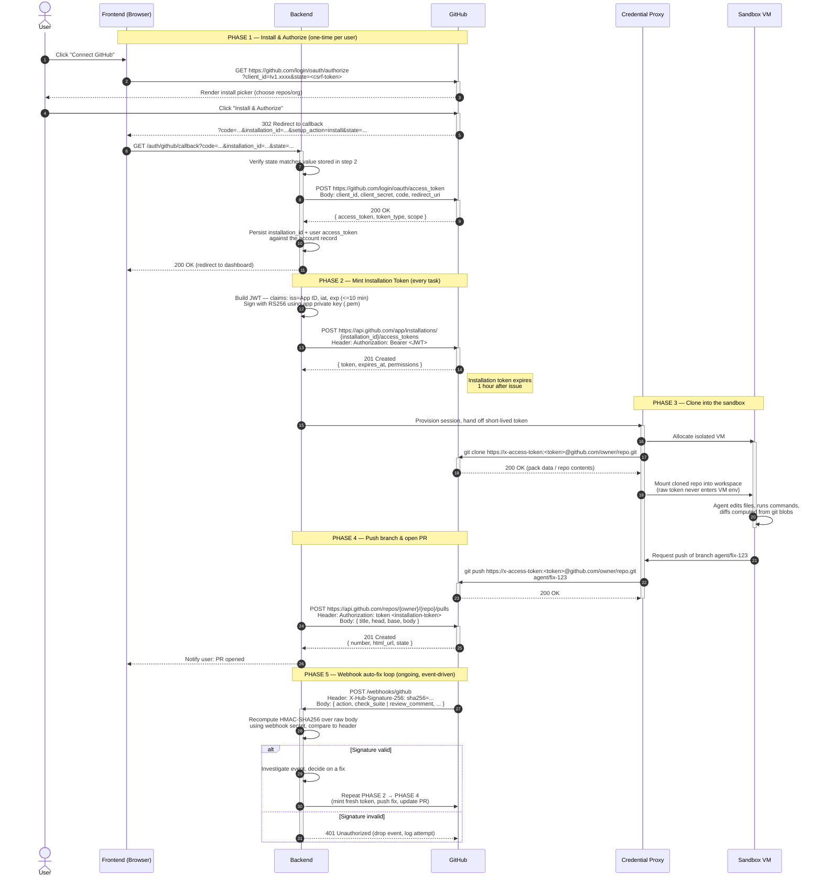

# GitHub App Auth Flow

How the agent goes from a user clicking "Connect GitHub" to opening pull
requests inside an isolated sandbox — five phases, one short-lived credential
at a time.

## Scope

This doc covers GitHub credential handling and repo access only: installing
the app, minting tokens, and getting code in and out of the sandbox via git.
It does not cover Agent Swarm, which drives the sandbox at runtime once the
repo is checked out, or the DB. See
[system-communication-protocols.md](system-communication-protocols.md) for
how this fits into the full system.

## Overview

The design keeps three kinds of credential separate, each scoped as tightly
as possible:

- **User OAuth token** — identifies who connected the account. Minted once at
  install time, used to attribute the connection to a user record.
- **Installation token** — a JWT-derived, repo-scoped token minted fresh
  before every task and valid for at most 1 hour. This is what actually
  touches repo contents (clone, push, PR creation).
- **Webhook secret** — not a credential passed around, but an HMAC key used
  to prove inbound webhook payloads really came from GitHub.

The sandbox VM never sees a raw token directly — the Credential Proxy holds
it and performs the git operations on the VM's behalf (see
[sandbox-viewer.md](sandbox-viewer.md) for the same pattern applied to the
sandbox's viewer surfaces).

## Components

- **FE** — frontend / browser
- **BE** — backend: owns the GitHub App private key, mints JWTs and
  installation tokens, persists account state
- **GH** — GitHub (OAuth, REST API, webhooks)
- **PX** — Credential Proxy: a Backend-owned Express service, not a
  standalone box on the system diagram. It's the only component that holds a
  live installation token, performs `git clone`/`git push` against GitHub on
  behalf of the sandbox, and manages the sandbox's lifecycle via the E2B SDK.
  Backend talks to PX over HTTP for all of this — see
  [system-communication-protocols.md](system-communication-protocols.md)
- **VM** — the sandbox where the agent actually edits code

## The five phases

1. **Install & Authorize** *(one-time per user)* — user installs the GitHub
   App and authorizes it; GitHub redirects back with a `code` and
   `installation_id`; the backend exchanges the code for a user access token
   and stores the installation mapping.
2. **Mint Installation Token** *(every task)* — the backend signs a
   short-lived JWT with the app's private key and exchanges it for a
   repo-scoped installation token, valid for up to 1 hour.
3. **Clone into the sandbox** — the Credential Proxy uses the installation
   token to clone the repo itself, then hands the checked-out files (not the
   token) to the sandbox VM.
4. **Push branch & open PR** — once the agent has made changes, the proxy
   pushes the branch using the same token, and the backend opens the PR via
   the REST API.
5. **Webhook auto-fix loop** *(ongoing, event-driven)* — GitHub notifies the
   backend of check failures or review comments; after verifying the
   webhook's HMAC signature, the backend repeats phases 2–4 to push a fix.

## Sequence diagram

## Open questions on Phase 1

- **Where does `state` come from?** Step 2 has the frontend redirect to
  GitHub with a `state` value before any call to the backend. It needs to be
  minted and stashed somewhere durable first (server-side session, or a
  signed cookie) — otherwise step 7's comparison has nothing to check
  against. A cleaner shape: the frontend calls a backend endpoint
  (`GET /auth/github/login`) first, the backend generates and stores
  `state`, then returns the GitHub authorize URL to redirect to.
- **Entry point for the install picker.** The org/repo picker is normally
  reached via the app's install URL (`/apps/<slug>/installations/new`), not
  `/login/oauth/authorize` directly. If "Request user authorization (OAuth)
  during installation" is enabled on the app, GitHub handles both steps and
  the callback receives `code` and `installation_id` together — which is
  what the rest of this flow assumes. Worth confirming the actual entry
  point matches this combined flow.
