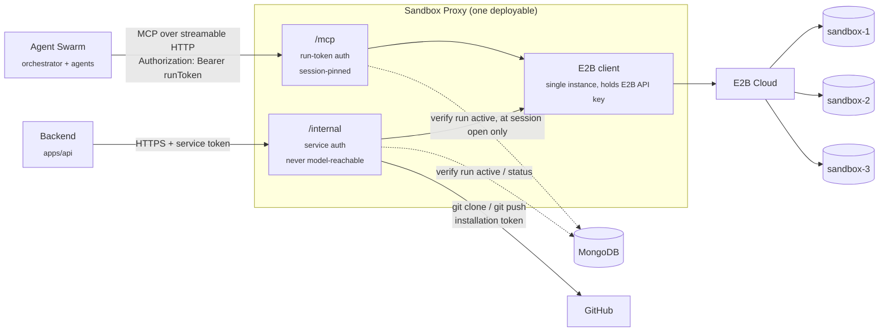
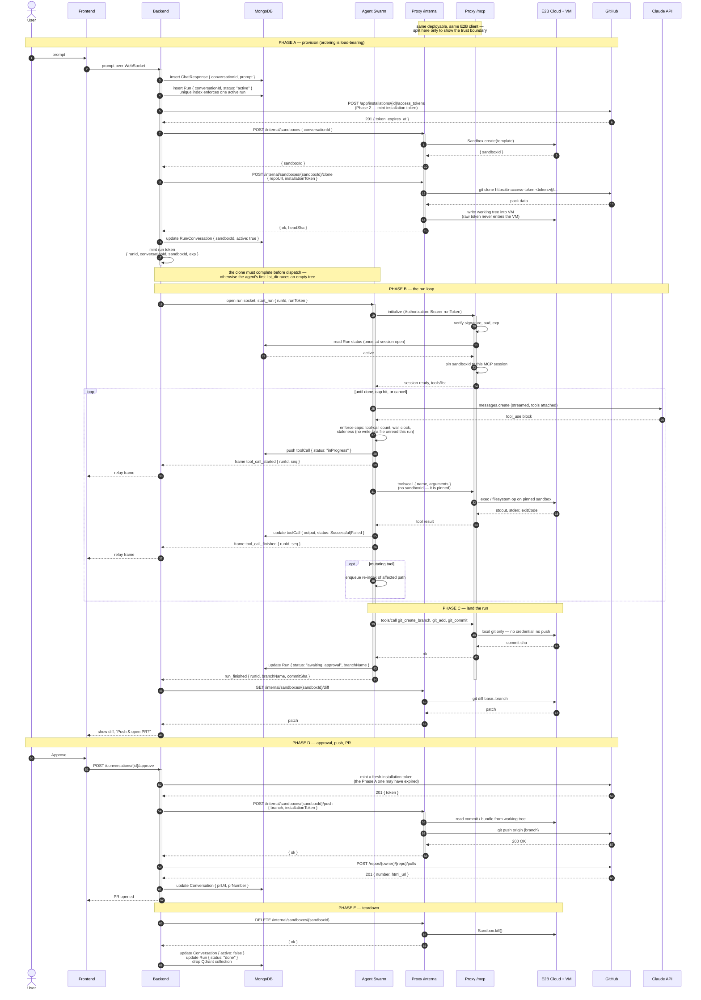

# Sandbox Proxy

The single choke point in front of every sandbox: an MCP server on the agent
side, a control API on the backend side, one E2B client and one set of
credentials behind both.

## Scope

This doc owns the sandbox proxy's design — its two faces, how a caller is
authenticated, how a call is routed to the right VM, and the full call
sequence of a run. It is self-contained and does not require changes to the
other docs, but it does **supersede** how they describe PX: those docs call
PX a Backend-owned in-process module
([system-communication-protocols.md](system-communication-protocols.md),
[github-app-auth-flow.md](github-app-auth-flow.md)). Here it is a standalone
deployable, because the Agent Swarm is also standalone and both now need to
reach it. See [Reconciliation](#reconciliation-with-the-other-docs).

The agent's own run loop, tool semantics, and caps stay in
[agent-swarm.md](agent-swarm.md). Persisted shape is
[data-model.md](data-model.md). The viewer surfaces are
[sandbox-viewer.md](sandbox-viewer.md).

## Why one box with two faces

Everything that touches a sandbox falls into one of two groups, and they have
opposite trust properties:

| | Model-facing | Backend-facing |
|---|---|---|
| Caller | Agent Swarm, on behalf of an LLM | Backend, on behalf of the platform |
| Operations | read/write files, exec, local git | provision, clone, push, kill, tree walk |
| Credentials involved | none | GitHub installation token, E2B API key |
| Argument source | partly model-generated | never model-generated |
| Blast radius of a bad call | one sandbox | any repo the app is installed on |

Modelling the second group as MCP tools would put credentialed operations
inside the surface an LLM can call — which is exactly what
[github-app-auth-flow.md](github-app-auth-flow.md) built the credential
boundary to prevent. So: two routers, one process.



The E2B client is **one shared module**, not one per face. Two instances would
mean two credential holders and two connection lifecycles for the same VMs.

## Identity and routing

This is the load-bearing part. A tool call arrives; the proxy must decide
*which VM* it is for and *whether the caller is entitled to it*. Getting this
wrong collapses the per-conversation VM isolation that
[agent-swarm.md](agent-swarm.md) calls the real security boundary.

### The run token

Backend mints it at dispatch, signed with the same key material it already
uses for sessions. It is a **bearer credential presented at the transport
layer** — never a tool parameter.

```
{
  "aud": "sandbox-proxy",
  "sub": "<runId>",
  "conversationId": "<conversationId>",
  "sandboxId": "<sandboxId>",
  "iat": ...,
  "exp": ...            // run wall-clock cap + margin
}
```

Two consequences worth being explicit about:

- **`sandboxId` is a signed claim, so the MCP path needs no per-call DB
  lookup.** The mapping is decided once, by Backend, at a moment when it
  already knows both ids. Resolving it per tool call would put a Mongo round
  trip on the latency path of all 30–50 calls in a run.
- **The model cannot express "the other sandbox."** No tool in the MCP surface
  takes a `sandboxId` or `conversationId` argument. If one did, prompt
  injection in a file the agent reads would be enough to name another tenant's
  VM — and the proxy holds credentials for all of them.

### Pinning

`sandboxId` is bound to the **MCP session** at initialize, not re-read per
call. Besides the latency, pinning is the more correct failure mode: if a
sandbox is killed and re-provisioned mid-run, a per-call lookup would silently
route later tool calls into a different VM with a different working tree, and
the agent would watch its own edits disappear. Pinned, the next call fails
loudly against a dead sandbox instead.

### The one DB read on the MCP path

At session open only, the proxy checks the `Run` row is still `active`. That
is what gives cancellation a hook — otherwise a signed token stays usable
until `exp` even after the user cancels. One read per run, not per call.

### Auth summary

| Face | Credential | Verified how | Scope granted |
|---|---|---|---|
| `/mcp` | run token (JWT) | signature + `aud` + `exp`, then one `Run` status read at session open | exactly one sandbox, for one run |
| `/internal` | service token | shared secret / mTLS, network-restricted | any sandbox — Backend is trusted |

`/internal` must not be internet-reachable. It is the face that can clone and
push with an installation token.

## The two surfaces

### `/mcp` — model-facing

Streamable HTTP. Tool definitions and semantics are
[agent-swarm.md](agent-swarm.md)'s tool surface, unchanged: `read_file`,
`list_dir`, `grep`, `write_file`, `edit_file`, `delete_file`, `move_file`,
`run_command`, `git_status`, `git_diff`, `git_create_branch`, `git_add`,
`git_commit`.

The query agent gets a read-only subset over its own session —
`read_file`, `list_dir`, `grep` — because `vector_search` returns paths only
and the file must be read live before it can be quoted.

### `/internal` — backend-facing

| Endpoint | Purpose | Phase |
|---|---|---|
| `POST /internal/sandboxes` | Provision a VM for a conversation | 3 |
| `POST /internal/sandboxes/:id/clone` | Clone with installation token | 3 |
| `GET /internal/sandboxes/:id/tree` | Walk the tree for initial indexing | — |
| `GET /internal/sandboxes/:id/diff` | Diff for the approval screen | 4 |
| `POST /internal/sandboxes/:id/push` | Push branch with installation token | 4 |
| `DELETE /internal/sandboxes/:id` | Kill the VM | — |
| `GET /internal/sandboxes/:id` | Liveness / status | — |

Phase numbers refer to
[github-app-auth-flow.md](github-app-auth-flow.md).

The installation token is passed **per call**, not stored — it is minted fresh
in Phase 2 and expires within the hour, and
[data-model.md](data-model.md) is explicit that it is never persisted.

## Full call sequence

Every call in a run, from prompt to PR. Phases A–E.



### Late join, reconnect, cancel

Unchanged from [agent-swarm.md](agent-swarm.md) — the proxy is not involved.
Frames replay from `ChatResponse.toolCalls`, ordered by `seq`. Cancel is
Backend flipping `Run.status`, which the swarm observes; the proxy's session
check only runs at open, so an in-flight tool call is not interrupted by it.

## Error semantics

Three layers can fail independently, and the orchestrator has to tell them
apart — a command that exits 1 is something the agent should react to and try
differently, while an unreachable proxy is something the run should abort on.
Collapsing those two into one `isError: true` is the bug to avoid.

| What happened | Wire form | What the orchestrator does |
|---|---|---|
| Command ran, exited non-zero | MCP **success** result, payload carries `exitCode`, `stdout`, `stderr` | Feed to model as a normal tool result; `toolCall.status = Successful` — the *call* worked |
| Tool rejected by policy (staleness, path escape, unknown tool) | MCP result with `isError: true`, message explains the rule | Feed to model so it can correct itself; `status = Failed` |
| Sandbox unreachable, E2B error, VM dead | JSON-RPC **protocol error** | Do not feed to model. Fail the run, `run_failed` frame |
| Token invalid, expired, or run no longer active | HTTP 401/403 at the transport, before MCP | Fail the run; never retried blindly |

The distinction that matters: rows 1–2 are *results*, rows 3–4 are
*infrastructure*. Only the first two ever reach the model.

## Sandbox lifetime

The proxy is stateless about lifetime — it kills what it is told to kill — but
something must decide. Two paths, both Backend's:

- **Normal:** Phase E above, after the PR is opened.
- **Reaper:** a periodic sweep over `Conversation.active = true` whose `Run`
  has been terminal for longer than the idle window, plus a hard ceiling on
  total sandbox age.

The reaper is not optional. A swarm that crashes mid-run leaks a VM
indefinitely otherwise, and nothing in the normal path will ever collect it.

This also resolves the lifetime question left open in
[agent-swarm.md](agent-swarm.md): the sandbox stays alive across the approval
window, and the reaper's idle window is therefore an upper bound on how long a
user has to approve before the push has to re-provision and replay.

## Reconciliation with the other docs

| Older text | Now |
|---|---|
| "PX is a Backend-owned module, in-process call" | Standalone deployable; Backend reaches it over HTTP on `/internal` |
| Agent Swarm holds its own E2B SDK client | Swarm has no E2B credentials at all; it reaches sandboxes only through `/mcp` |
| Two SDK clients, one for PX and one for the swarm | One client, inside the proxy |
| Viewer tickets minted by PX | Unchanged — the viewer data plane still bypasses the proxy entirely |

The credential boundary is stronger under this shape, not weaker: previously
the swarm held E2B credentials directly, so a compromised swarm could reach
any sandbox. Now its reach is bounded by a signed, expiring, single-sandbox
token.

## Open questions

- **Where the run token is signed.** Reusing `SESSION_SECRET` is the shortest
  path but couples browser sessions and service auth to one key. A separate
  keypair (RS256, proxy holds only the public key) is the better end state and
  matches how the viewer ticket is already specified.
- **Push after a long approval delay.** Phase D reads the commit from the
  working tree. If the reaper collected the VM first, Backend must either
  re-provision and replay the commit, or the proxy must hold the commit as a
  bundle at Phase C. The bundle is cheaper and removes the dependency on the
  VM outliving approval entirely — worth doing at Phase C unconditionally.
- **Streaming `run_command` output.** The sequence above returns the result
  whole. Long builds would stream better, and E2B's exec is a websocket
  underneath, but MCP tool results are not incremental — the output would need
  a side channel or chunking through a separate notification.
- **Rate limiting per run.** The tool-call cap is enforced in the
  orchestrator. The proxy currently trusts it. A per-token counter at the
  proxy would make the cap hold even if the orchestrator is buggy, at the cost
  of a second place that knows the limit.
- **Indexing reads go through `/internal`.** The tree walk is orchestrator
  work but uses the backend-facing face, which the swarm otherwise cannot
  reach. Either Backend performs the walk and hands the swarm the contents, or
  a third narrow face exists for it. Currently unresolved.
