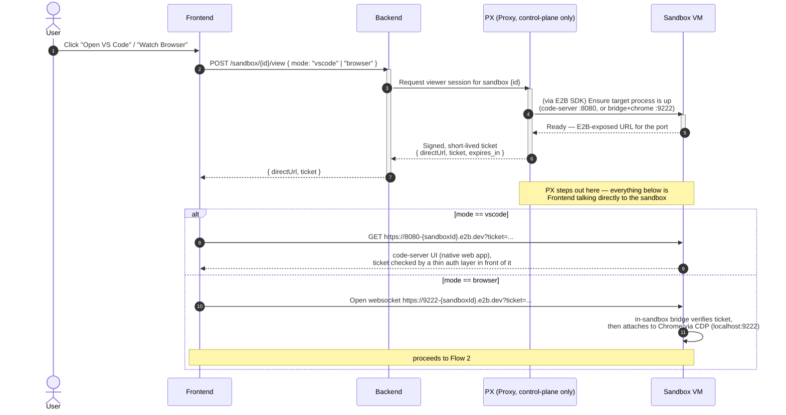

# Sandbox Viewer: VS Code & Browser Access

How the agent exposes a live VS Code instance and a live browser running inside
the sandbox VM, so the frontend can display and operate them on demand.

## Scope

This doc covers the Frontend↔Sandbox viewing/operating surfaces (VS Code,
browser) only. It doesn't cover Agent Swarm, which drives the sandbox
independently at runtime — see
[system-communication-protocols.md](system-communication-protocols.md) for
how this fits into the full system.

## Overview

Two very different display problems live under one ask:

- **VS Code** — `code-server` already serves a full web UI. Once its port is
  reachable, an iframe *is* the client. No frame relay, no input relay — the
  browser's native DOM/keyboard events go straight into the iframe.
- **Browser** — there's nothing to iframe (you don't want to expose a raw
  remote-desktop port to the internet). Instead the sandbox's headless/headed
  Chrome exposes CDP (Chrome DevTools Protocol); a small bridge process
  inside the sandbox pulls a screencast frame stream out and relays it to a
  `<canvas>` on the frontend, and relays clicks/keys back in the other
  direction.

PX only brokers these sessions — it verifies the frontend holds a valid
session, mints a short-lived signed ticket, and hands back the sandbox's own
E2B-exposed URL. It does **not** sit in the streaming data path: the frontend
connects *directly* to the sandbox for both VS Code and the browser, which
keeps PX's load flat regardless of how many viewer sessions are open at once.
The tradeoff is that something inside the sandbox has to validate the ticket
itself, since neither `code-server`'s default auth nor raw CDP does that for
you.

## Components

- `code-server` — runs inside the sandbox VM, bound to a local port (e.g. `8080`)
- headless/headed Chrome with `--remote-debugging-port` — runs inside the
  sandbox VM (e.g. `9222`)
- **in-sandbox bridge** — a small process baked into the sandbox image that
  validates a viewer ticket (checked against a public verify-key, not the
  signing key) before relaying to `code-server` or CDP
- **PX (Credential/View Proxy)** — a Backend-owned Express service; verifies
  the frontend's session, mints tickets, and manages the sandbox via the E2B
  SDK — control-plane only, never touches a frame or an input event
- **FE** — iframe for VS Code, `<canvas>` + websocket for the browser, both
  connected directly to the sandbox's E2B-exposed URL

## Flow 1 — opening a viewer session (either mode)



## Flow 2 — browser: streaming pixels out, input in

```mermaid
sequenceDiagram
    autonumber
    participant FE as Frontend (canvas)
    participant BR as In-sandbox bridge
    participant CR as Chrome (CDP, in sandbox)

    Note over FE,BR: connection is direct — see Flow 1;<br/>PX is not involved past ticket issuance
    BR->>CR: Page.startScreencast { format: "jpeg", quality: 70 }
    loop while session open
        CR-->>BR: Page.screencastFrame { data: base64, sessionId }
        BR-->>FE: forward frame over websocket
        FE->>FE: draw frame to <canvas>
        BR->>CR: Page.screencastFrameAck { sessionId }
    end

    Note over FE: user interacts with the canvas
    FE->>BR: { type: "click"|"key", x, y, key } over websocket
    BR->>CR: Input.dispatchMouseEvent / Input.dispatchKeyEvent
    CR->>CR: page updates in response
    Note over CR,FE: next screencastFrame reflects the change
```

## Why the two modes differ

VS Code needs no relay because `code-server` is already a browser app — the
iframe boundary *is* the transport. The browser has no such native web
surface, so CDP screencast + input-dispatch is standing in as a thin
remote-control protocol running through the in-sandbox bridge instead of PX;
that also means the "operate" direction (Flow 2's back half) only exists for
the browser case, not VS Code. Keep frame quality/scale tunable (CDP's
`Page.startScreencast` takes `maxWidth`/`maxHeight`/`everyNthFrame`) — it's
the main lever against bandwidth if many viewer sessions are open at once,
since that cost now lands on each sandbox rather than on a shared proxy.
