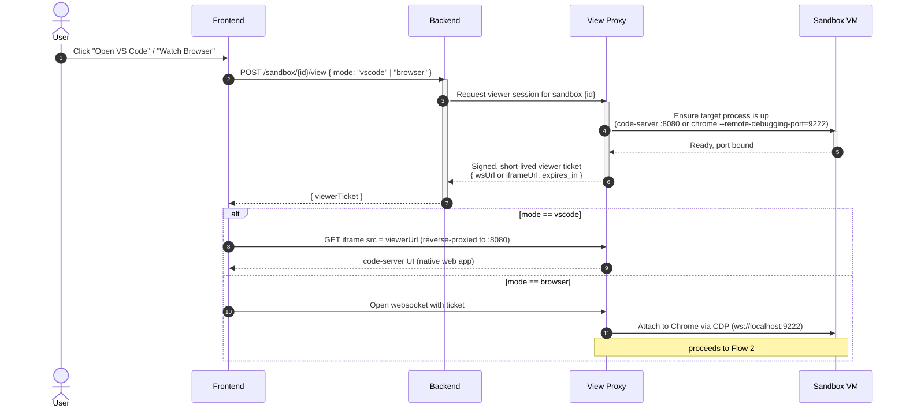
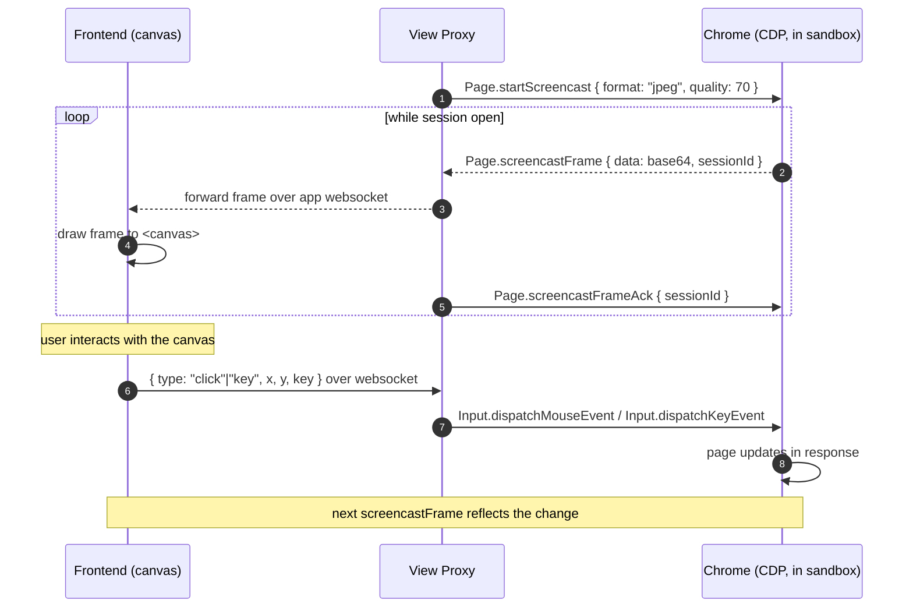

# Sandbox Viewer: VS Code & Browser Access

How the agent exposes a live VS Code instance and a live browser running inside
the sandbox VM, so the frontend can display and operate them on demand.

## Overview

Two very different display problems live under one ask:

- **VS Code** — `code-server` already serves a full web UI. Once its port is
  reachable, an iframe *is* the client. No frame relay, no input relay — the
  browser's native DOM/keyboard events go straight into the iframe.
- **Browser** — there's nothing to iframe (you don't want to expose a raw
  remote-desktop port to the internet). Instead the sandbox's headless/headed
  Chrome exposes CDP (Chrome DevTools Protocol); the proxy pulls a screencast
  frame stream out and relays it to a `<canvas>` on the frontend, and relays
  clicks/keys back in the other direction.

Both are gated behind the same Credential Proxy so a sandbox's viewer surface
isn't reachable by anyone who doesn't hold a valid session for it.

## Components

- `code-server` — runs inside the sandbox VM, bound to a local port (e.g. `8080`)
- headless/headed Chrome with `--remote-debugging-port` — runs inside the
  sandbox VM (e.g. `9222`)
- **PX (Credential/View Proxy)** — reverse-proxies `code-server`, and speaks
  CDP to Chrome on one side / a plain websocket to the frontend on the other
- **FE** — iframe for VS Code, `<canvas>` + websocket for the browser

## Flow 1 — opening a viewer session (either mode)

## Flow 2 — browser: streaming pixels out, input in

## Why the two modes differ

VS Code needs no relay because `code-server` is already a browser app — the
iframe boundary *is* the transport. The browser has no such native web
surface, so CDP screencast + input-dispatch is standing in as a thin
remote-control protocol; that also means the "operate" direction (Flow 2's
back half) only exists for the browser case, not VS Code. Keep frame
quality/scale tunable (CDP's `Page.startScreencast` takes
`maxWidth`/`maxHeight`/`everyNthFrame`) — it's the main lever against
bandwidth and proxy CPU if multiple sandboxes stream at once.
