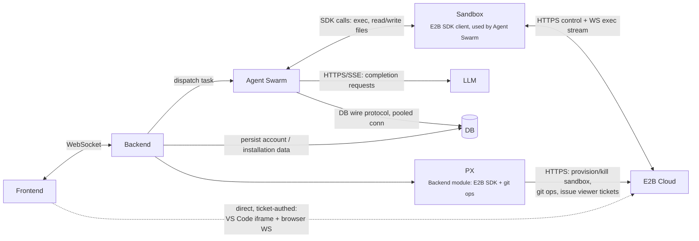

# System Communication Protocols

Every link between the core services, what protocol carries it, and why.
Covers: Frontend, Backend, Agent Swarm, LLM, DB, Sandbox (E2B SDK client),
E2B Cloud.

## Diagram

Dashed edge = confirmed but not drawn on the original whiteboard sketch.

## Edge by edge

| Edge | Protocol | Direction | Purpose |
|---|---|---|---|
| Frontend ↔ Backend | WebSocket | bidirectional | Live channel for chat/agent-status streaming and, per [sandbox-viewer.md](sandbox-viewer.md), issuing viewer tickets. One-off requests (GitHub OAuth callback, etc.) still go over plain HTTP — see [github-app-auth-flow.md](github-app-auth-flow.md). |
| Frontend → E2B Cloud | HTTPS (iframe) / WebSocket, both ticket-authed | one-way per session | The viewer data plane: once Backend/PX hands back a signed ticket, Frontend connects straight to the sandbox's E2B-exposed URL for VS Code and the browser, bypassing Backend/PX entirely. See [sandbox-viewer.md](sandbox-viewer.md). |
| Backend → Agent Swarm | *depends on deployment* | one-way (dispatch) | Backend hands off a task to the swarm. If Agent Swarm runs in the same process, this is a direct function call or an in-memory job enqueue; if it's a separate service, it needs an internal RPC (HTTP or gRPC). **Open question below.** |
| Backend → DB | DB wire protocol (e.g. Postgres) over a pooled TCP connection | one-way (write) | Persists account/installation records from the GitHub auth flow — see [github-app-auth-flow.md](github-app-auth-flow.md). Separate connection from Agent Swarm's own DB access below. |
| Backend → PX | in-process call (PX is a Backend module, not a separate network hop) | one-way | Delegates sandbox provisioning, git operations, and viewer-ticket issuance. |
| PX → E2B Cloud | HTTPS (REST, via E2B SDK) | one-way | Control-plane only: provision/kill a sandbox, run the git clone/push described in [github-app-auth-flow.md](github-app-auth-flow.md), issue viewer tickets for [sandbox-viewer.md](sandbox-viewer.md). Never touches a frame or an input event. |
| Agent Swarm → LLM | HTTPS, REST + SSE streaming | one-way (request/response) | Standard model-provider API call (e.g. Anthropic/OpenAI completions), streamed token-by-token back to the swarm. |
| Agent Swarm → DB | DB wire protocol (e.g. Postgres) over a pooled TCP connection | one-way (query/write) | Not HTTP — a normal driver/ORM connection, since Agent Swarm talks to the DB directly rather than through an API layer. |
| Agent Swarm ↔ Sandbox | E2B SDK method calls (`runCommand`, `filesystem.write/read`, etc.) | bidirectional | This is the "Sandbox" box as drawn — a thin client the swarm calls into, not a separate network hop by itself. A *different* SDK client than PX's — same E2B Cloud target, two separate callers for two separate purposes (runtime exec vs. provisioning/git/tickets). |
| Sandbox (SDK) ↔ E2B Cloud | HTTPS for control ops (create/list/kill, file upload/download) + WebSocket for streaming command execution (stdout/stderr/exit code) | bidirectional | This is where the SDK calls actually leave the process — E2B's own client/server transport. |

## Resolved since last revision

- **PX isn't a missing box** — it's a Backend-owned module/Express service
  that implements the Backend→E2B Cloud edge (plus git ops, which don't go
  through E2B at all). It was never meant to be a peer of Backend on the
  whiteboard.
- **Agent Swarm is intentionally absent from docs 1–2** — those two are
  scoped to GitHub credential handling and the Frontend↔Sandbox viewer,
  neither of which involves the swarm.
- **Backend → DB is real**, just not drawn on the original sketch — it's how
  account/installation data from the GitHub auth flow gets persisted,
  independent of Agent Swarm's own DB connection.
- **Frontend → E2B Cloud (direct) is the intended design** for the viewer,
  even though it isn't on the original sketch — see the ticket-broker model
  in [sandbox-viewer.md](sandbox-viewer.md).

## Open questions

- **Backend → Agent Swarm protocol.** Depends on whether the swarm is
  in-process with the backend or a standalone service. If standalone: HTTP
  is simplest and matches the rest of your control-plane calls; if tasks can
  run long, consider a queue (so the backend doesn't hold an open request for
  the whole agent run) rather than a raw synchronous HTTP call.
- **"What all runs in the sandbox"** — your note mentions `1. installation
  (npm...)` but was cut off. Worth spelling out the full list of what gets
  installed/bootstrapped in the sandbox before the agent starts editing, so
  it can be baked into a base image rather than repeated per task.
- **"How is data being ...?"** — also cut off. If this is asking how agent
  output (diffs, logs, file state) gets from the Sandbox back to the DB/
  Backend, that path isn't drawn yet — worth adding once you confirm what
  you meant.
